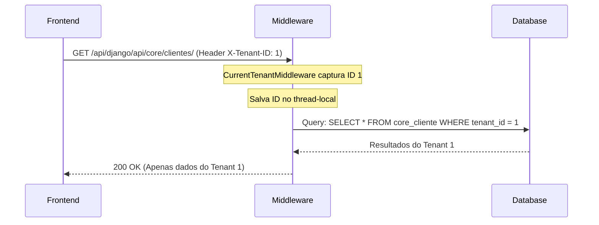

# Especificação de Arquitetura

O sistema **SIMU_MES Oficina** é construído utilizando uma arquitetura distribuída, projetada para escalabilidade e independência do frontend. A seguir, detalhamos cada uma das camadas de software e a infraestrutura local.

## Stack Tecnológica

| Camada | Tecnologia | Detalhes / Versão |
| :--- | :--- | :--- |
| **Frontend** | React 19, Vite, TypeScript | SPA rápida com suporte a estados em Zustand e estilização baseada no TailwindCSS v4. |
| **Backend Django** | Python 3, Django 5.2, DRF | Núcleo de regras de negócio, persistência, permissões e APIs REST (ViewSets). |
| **Backend FastAPI** | Python 3, FastAPI | Microsserviço de processamento leve para tarefas paralelas. |
| **Banco de Dados** | PostgreSQL 15 | Banco relacional para dados transacionais da oficina e catálogos. |
| **Containerização** | Docker, Docker Compose | Execução local isolada dos serviços. |

---

## Estrutura do Docker Compose

Os serviços locais são orquestrados usando Docker Compose. As portas mapeadas externamente são:

- **Frontend (Vite Dev)**: Porta `5001` (mapeada para `5173` interno).
- **Backend Django**: Porta `5002` (mapeada para `8000` interno).
- **Backend FastAPI**: Porta `5003` (mapeada para `8001` interno).
- **PostgreSQL**: Porta `5004` (mapeada para `5432` interno).

---

## Proxy de APIs (Vite Proxy)

Para evitar problemas de CORS e manter chamadas simplificadas no frontend, o Vite atua como um proxy reverso. O arquivo `frontend/vite.config.ts` intercepta requisições que iniciam com `/api/` e as redireciona para seus respectivos servidores antes de remover o prefixo da rota.

- **Django**: `/api/django/*` ➔ `http://127.0.0.1:5002/api/*`
  - *Nota*: As chamadas do frontend usam `/api/django/api/...` (duplo `/api`), pois o proxy remove o primeiro `/api/django` e envia `/api/...` ao Django.
- **FastAPI**: `/api/fastapi/*` ➔ `http://127.0.0.1:5003/api/*`

---

## Lógica Multitenant (Múltiplos Inquilinos)

A aplicação isola os dados de diferentes oficinas de forma transparente via cabeçalho HTTP:

### Detalhes de Implementação no Backend

1. **Middleware (`core.middleware.CurrentTenantMiddleware`):**
   Intercepte requisições e salva o ID do cabeçalho `X-Tenant-ID` no thread-local local da requisição.
2. **Modelo Abstrato (`core.models.TenantModel`):**
   Adiciona um campo `tenant` (`ForeignKey` vinculada a `core.EmpresaFilial` com `null=True`) a todos os modelos isolados de cada inquilino.
3. **ViewSet Base (`core.views.TenantModelViewSet`):**
   - Sobrescreve `get_queryset()` para filtrar os dados baseados no `tenant_id` ativo no thread-local.
   - Sobrescreve `perform_create()` para injetar o `tenant_id` atual no modelo automaticamente ao criar novos registros.
