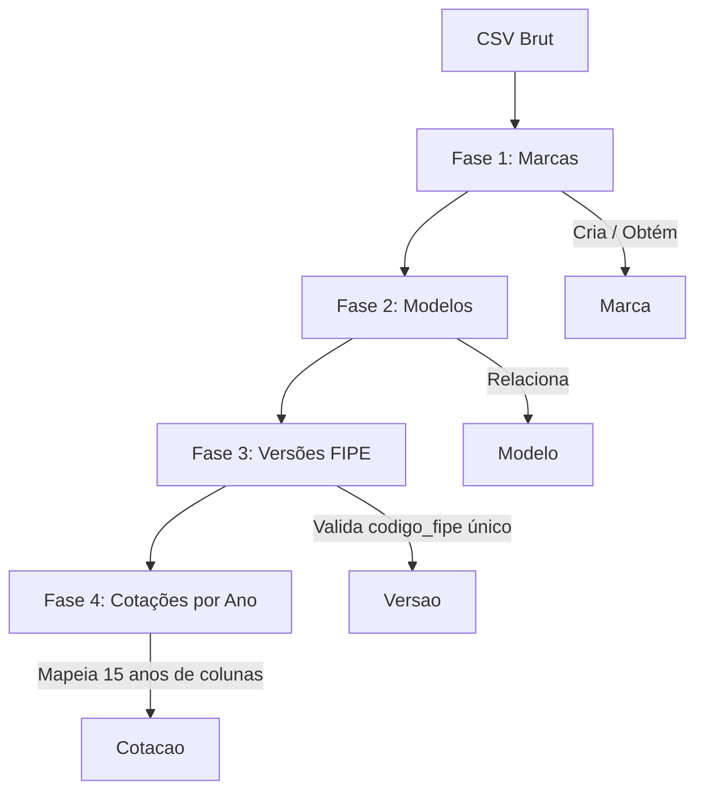

# Processamento do Catálogo FIPE

O projeto **SIMU_MES Oficina** possui um catálogo de veículos populado a partir de dados reais da tabela FIPE. Este documento descreve as especificações e o fluxo de importação desses dados.

---

## 📂 Arquivos de Origem

Os arquivos de dados brutos encontram-se na pasta `Docs/`:
- `Lista veiculos 2.CSV`: O arquivo principal utilizado pelo script. Contém 11.758 linhas delimitadas por ponto e vírgula (`;`) codificadas em `latin-1`.
- `Lista veiculos 2.xlsx`/`pdf`: Versões em planilha e PDF para verificação de relatórios.

---

## ⚡ Fluxo de Importação (ETL)

A importação é dividida em **4 fases sequenciais** para respeitar a integridade das chaves estrangeiras (Foreign Keys):



### Fase 1: Marcas (`veic_marca`)
O script extrai o campo `Fabricante` de cada linha do CSV.
- Registros vazios ou nulos são pulados.
- É feito um upsert usando `get_or_create` para evitar duplicatas.

### Fase 2: Modelos (`veic_modelo`)
Extrai a combinação única de `Fabricante` e `Modelo` do CSV.
- A categoria é mapeada dinamicamente com base em strings da coluna `Categoria` para os enums de `CategoriaVeiculo` do Django:
  - `"AUTOM"` ➔ `CARRO`
  - `"MOTO"` ➔ `MOTO`
  - `"CAMINHON"` ➔ `UTILITARIO`
  - `"CAMINHO"` ➔ `CAMINHAO`
  - `"ONIB"` ➔ `ONIBUS`
  - Caso não bata com as regras, cai em `OUTRO`.

### Fase 3: Versões (`veic_versao`)
Cada linha possui um código FIPE exclusivo na coluna `Cod.`.
- O script valida se o código FIPE é único.
- Mapeia o combustível da linha:
  - `G`/`GASOLINA` ➔ `GASOLINA`
  - `A`/`ALCOOL` ➔ `ALCOOL`
  - `F`/`FLEX` ➔ `FLEX`
  - `D`/`DIESEL` ➔ `DIESEL`
  - `E`/`ELETRICO` ➔ `ELETRICO`
  - `H`/`HIBRIDO` ➔ `HIBRIDO`
  - `COMB` ➔ Fallback para `GASOLINA`

### Fase 4: Cotações (`veic_cotacao_mercado`)
A tabela FIPE original expõe os valores em colunas anuais (de `2002` a `2016`). A importação normaliza isso no banco relacional transformando colunas em linhas.
- Lê as colunas `2002` até `2016`.
- Limpa a string de moeda (ex: `R$ 28.059,00` ➔ `Decimal('28059.00')`).
- Insere em lote (`bulk_create`) ignorando conflitos de chave para garantir idempotência do processo.

---

## 🛠️ Scripts Disponíveis

Os scripts encontram-se em `backend/django_app/`:

1. **`import_veiculos.py`**: Importação sequencial síncrona. Recomendada para a primeira carga.
2. **`import_veiculos_batches.py`**: Importação otimizada dividida em blocos (Batches) de transações para diminuir o consumo de memória ao lidar com os 11 mil registros.

Para rodar a importação dentro do container do Django:
```bash
docker compose exec django python import_veiculos_batches.py
```
